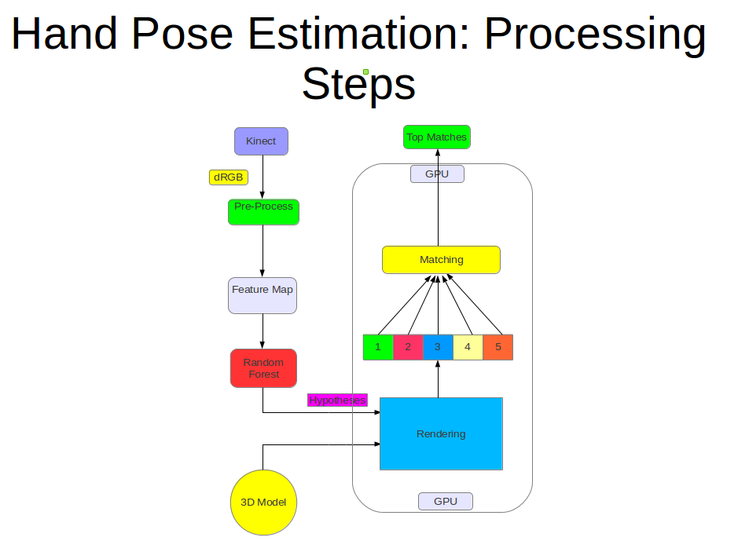
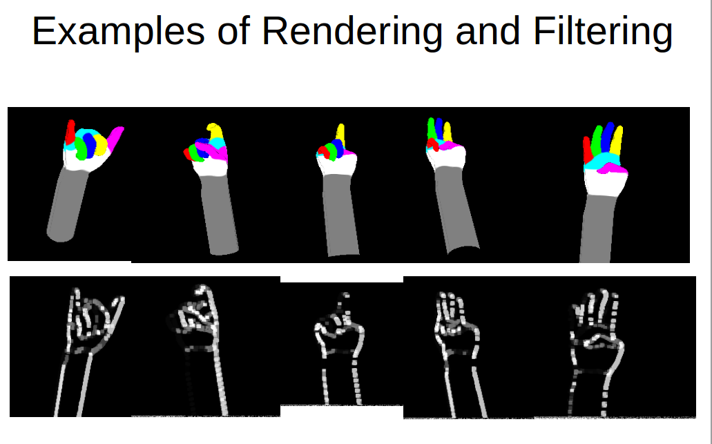

This code was written during my internship at the Bioinformatics Institute in Singapore. It is part of a larger system for hand pose estimation. Candidate hand poses
(produced by a random forest) were (a) rendered on GPU textures using a 3D hand model, (b) filtered and smoothed, (c) compared to the actual hand pose obtained from a Kinect depth image to
select the best match. More information is available in the presentation.

---

---

---

